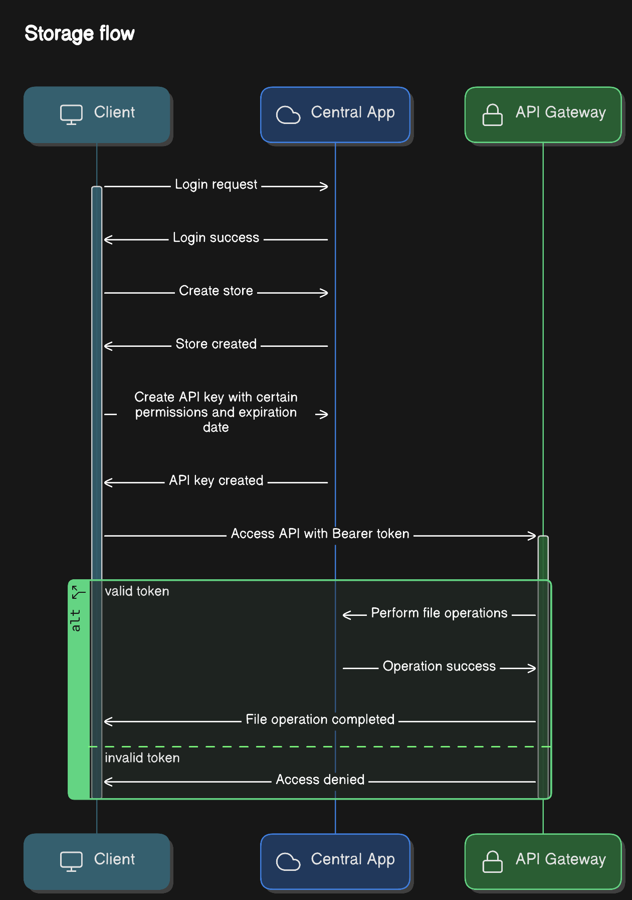

# GStore

GStore is a self-hosted storage solution for institutions, companies, and developers. It provides a central management interface and API to handle file storage, with advanced features like file transformations and fine-grained access control.

## Features

- **Central App**
  - User authentication
  - Manage virtual stores (create, delete)
  - Create API keys with specific permissions and expiration dates
  - View files in stores
- **Storage API**
  - Full file operations (create, delete, update, read, list files)
  - Built-in transformations (e.g., merge PDFs, image resizing, video encoding)
    - Image transformations
    - PDF transformations
    - Video transformations
  - Support for public and private files
  - API key authentication
  - Scaler UI documentation
  - Zod validation for all request parts (parameters, query, body)
  - Rate limiting and file size restrictions
- **Extendability**
  - We will have other apps on the future that extend the functionality of the api.
  - Examples can be a backup cli or desktop app for visual management of the files.

## Architecture


- **Central App**: A SvelteKit app for store management (`central.domain`)
- **API**: A Hono Bun server for file operations (`api.domain`)
- **Database**: PostgreSQL for storing file metadata, store information, API keys, and user details
- **Proxy**: Traefik for routing and serving as an API gateway
- **Storage**: File system-based storage

## How It Works

### Flow

GStore follows a typical storage flow:

1. Log in to the central app
2. Create a store
3. Create an API key
4. Use the API key to access the API server endpoints



### Storage Mechanism

GStore stores file metadata in a database while saving the actual file content in the file system. Each file is assigned a unique identifier called an **index**. File metadata includes:

- Name
- Extension
- Size
- Creation date
- Public/private status
- Tags
- Store ID

Files can have tags, which are useful for organizing and linking related files (e.g., ["images", "png"]). There is an endpoint that allows you to download a zip of all files with the same set of tags.

Files can be either public or private. Public files are served statically, meaning anyone can access them if they know the file's index.

### Transformations

Transformations are operations performed on files. The files used in transformations must already exist in the specified store. Many transformations share a general format for the request body:

```json
{
  "id": "EILvhPP_",
  "outputMethod": { "type": "return" }
}
```

- `id`: The ID of the file being transformed
- `outputMethod`: Specifies what to do with the result (either **return** it, **create** a new file with it, or **update** a file with same extension.)

Some transformations require additional information, such as a **sigma** value for image blurring. Others, like updating PDF metadata, may have different request formats.

## Folder Structure

The project follows a monorepo structure:

```
gstore/
├── apps/
│   ├── api/
│   └── central/
├── .env.example
├── docker-compose.prod.yml
└── docker-compose.dev.yml
```

Each workspace can be deployed separately using its own Dockerfile or together using the root `docker-compose.prod.yml` file. You'll find `.env.example` files in each workspace, along with a **README** file for more details.

## Usage

The steps to run GStore will vary based on your setup. Below are the general steps for running GStore locally and in production.

### Local Setup

1. Clone the repo: `git clone git@github.com:EMPTYVOID-DEV/g-store.git`
2. Create a `.env` file using the `.env.example` template
3. Run: `sudo docker-compose -f docker-compose.dev.yml up`

### Production Setup

1. Get a public domain name
2. Configure DNS records for your domain to include `api.domain`, `central.domain`, and `traefik.domain`, pointing them to your server’s IP address
3. Create a `.env` file using the `.env.example` template
4. Run: `sudo docker-compose -f docker-compose.prod.yml up`. Traefik will automatically handle Let's Encrypt SSL certificates for your domains

#### Note

1. Docker compose will build and run the central app , the api , postgres and traefik. For other apps each can be run on it own.

# V2 Features

- **Enhanced Monitoring**: Integration with the ELK stack for comprehensive logging
- **Auto-scaling**:
  - KEDA integration for automatic scaling based on requests
  - NFS storage support for distributed file access

## License

MIT License. See the [LICENSE](https://opensource.org/license/mit) file for details.
