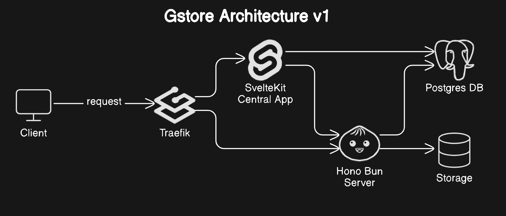

# GStore

GStore is a self-hosted storage solution designed for organizations and developers. It offers a centralized management interface and an API for seamless file storage, along with advanced features such as file transformations and granular access control.

## Features

- **Central Application**
  - User authentication
  - User management via an admin account
  - Virtual store management (creation and deletion)
  - API key management with customizable permissions and expiration settings
- **Storage API**
  - Comprehensive file operations (create, read, update, delete, list)
  - Integrated file transformation capabilities:
    - Image processing
    - PDF manipulation
    - Video encoding
  - Support for both public and private files
  - API key-based authentication
  - Extensive API documentation with Scalar UI
  - Request validation using Zod (parameters, queries, bodies)
  - Rate limiting and file size restrictions
- **Additional Applications**
  - Command-line interface (CLI) for automation and CI/CD workflows
  - Desktop application for visual file management (currently under development)

## Architecture



- **Central Application**: A SvelteKit-based management interface (`central.domain`)
- **API**: A Hono Bun server handling file operations (`api.domain`)
- **Database**: PostgreSQL used for metadata storage
- **Proxy**: Traefik acting as the routing and API gateway
- **Storage**: A file system-based solution for efficient storage
- **External Components**: The desktop application, CLI, and other integrations access the system exclusively via the proxy.

## Project Structure

The project follows a monorepo architecture:

```
gstore/
├── apps/
│   ├── api/
│   ├── cli/
│   ├── desktop/
│   └── central/
├── packages/
│   └── db/
├── docker/
└── .env.example
```

1. The `apps/` directory contains the various applications.
2. The `packages/` directory houses shared functionalities and utilities.
3. Docker configuration files are stored in the `docker/` folder.
4. Each workspace includes a dedicated `README` file with specific details and an optional `.env.example` template.

## Usage

### Prerequisites

- [Docker](https://docs.docker.com/engine/install/)
- [Docker Compose](https://docs.docker.com/compose/install/)

### Setup Steps

1. **Clone the Repository**

   ```bash
   git clone https://github.com/EMPTYVOID-DEV/GStore
   ```

2. **Configure the Environment**

   - Copy `.env.example` to `.env`
   - Fill in the required environment variables

3. **Run the Application**

   ```bash
   docker-compose -f docker/docker-compose.yml --env-file=.env up -d
   ```

   For testing run the docker-compose.dev.yml which uses http.

### For Deployment

- Ensure your server is configured with a public domain.
- Ensure ports 80 and 443 are exposed.
- Update your DNS provider to create A or CNAME records:
  - `api.domain` → server public IP
  - `central.domain` → server public IP

### For Testing

1. **Testing on a remote server**:

   - Ensure ports 80 and 443 are exposed.
   - Modify the local `/etc/hosts` file to map subdomains to the server IP:
     ```
     <SERVER_IP_ADDRESS> api.domain
     <SERVER_IP_ADDRESS> central.domain
     ```

2. **Testing locally**:

   - Modify the `/etc/hosts` file to map subdomains to the loopback address:
     ```
     127.0.0.1 api.domain
     127.0.0.1 central.domain
     ```

### Access Points

- Central Application: `central.domain`
- API Server: `api.domain`

### First-Time Use

1. Log in with admin credentials.
2. Create a store.
3. Generate an API key.
4. Start using the API.

## License

This project is licensed under the MIT License. For more details, refer to the [LICENSE](https://opensource.org/license/mit).
