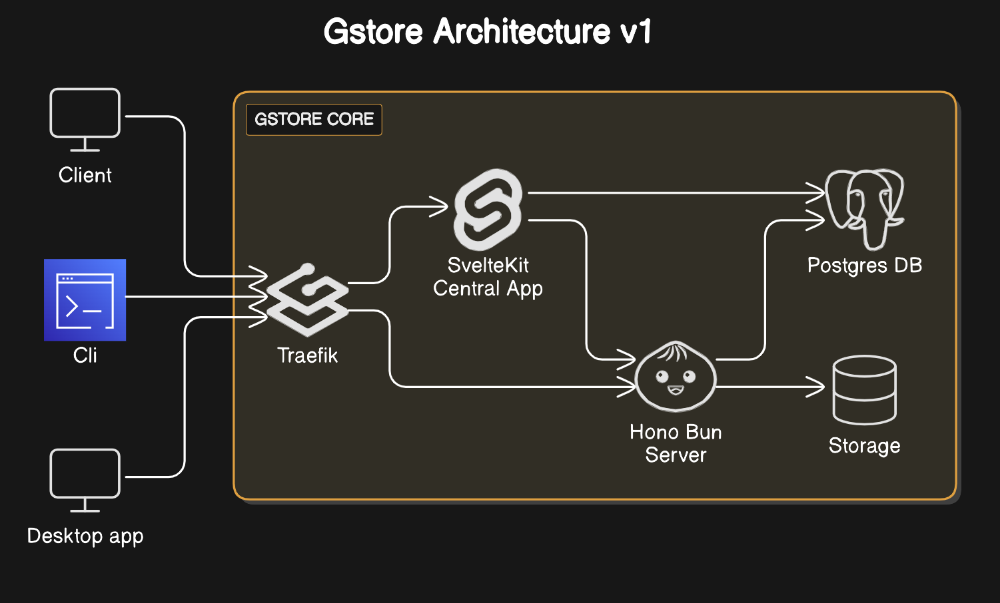

# GStore

GStore is a self-hosted storage solution designed for organizations and developers. It offers a centralized management interface and an API for seamless file storage, coupled with advanced features like file transformations and granular access control.

## Features

- **Central Application**
  - User authentication
  - User management through an admin account
  - Virtual store management (creation and deletion)
  - API key management with customizable permissions and expiration settings
- **Storage API**
  - Comprehensive file operations (create, read, update, delete, list)
  - Integrated file transformation capabilities:
    - Image processing
    - PDF manipulation
    - Video encoding
  - Support for both public and private files
  - API key-based authentication
  - Extensive API documentation with Scalar UI
  - Request validation leveraging Zod (parameters, queries, bodies)
  - Rate limiting and file size restrictions
- **Additional Applications**
  - Command-line interface (CLI) for automation and CI/CD workflows
  - Desktop application for visual file management (currently under development)

## Architecture



- **Central Application**: SvelteKit-based management interface (`central.domain`)
- **API**: Hono Bun server handling file operations (`api.domain`)
- **Database**: PostgreSQL used for metadata storage
- **Proxy**: Traefik acting as the routing and API gateway (`traefik.domain`)
- **Storage**: File system-based solution for efficient storage
- **External Components**: The desktop application, CLI, and other integrations only access the system via the proxy.

## Project Structure

The project follows a monorepo architecture:

```
gstore/
├── apps/
│   ├── api/
│   ├── cli/
│   ├── desktop/
│   └── central/
├── packages/
│   └── db/
├── docker/
└── .env.example
```

1. The `apps/` directory contains the various applications.
2. The `packages/` directory houses shared functionality and utilities.
3. Docker configuration files are included in the `docker/` folder.
4. Each workspace has a dedicated `README` file with specific details and an optional `.env.example` template.

## Usage

### Prerequisites

- [Docker](https://docs.docker.com/engine/install/)
- [Docker Compose](https://docs.docker.com/compose/install/)

### Setup Steps

1. **Clone the Repository**

   ```bash
   git clone https://github.com/EMPTYVOID-DEV/GStore
   ```

2. **Configure Environment**

   - Copy `.env.example` to `.env`
   - Fill in required environment variables

3. **Run the Application**

   **Development:**

   ```bash
   docker-compose -f docker/docker-compose.dev.yml --env-file=.env up
   ```

   **Production:**

   ```bash
   docker-compose -f docker/docker-compose.prod.yml --env-file=.env up -d
   ```

### Access Points

- Central Application: `central.domain`
- API Server: `api.domain`
- Traefik Dashboard: `traefik.domain`

### First-Time Use

1. Log in with admin credentials
2. Create a store
3. Generate an API key
4. Start using the API

### For Production Deployments

1. **Public Domain Setup**:

   - Ensure your VPS is configured with a public domain for automatic Let's Encrypt SSL certificates otherwise traefik will use default certificate.

2. **Port Configuration**:

   - Open ports 80 (HTTP) and 443 (HTTPS) on your VPS
   - Check firewall rules to confirm port exposure

3. **DNS Records**:
   - Update DNS provider to create A or CNAME records:
     - `api.domain` → VPS public IP
     - `central.domain` → VPS public IP

### Development Environments

**1. Running on a VPS**:

- Ensure ports 80 and 443 are exposed
- Modify local `/etc/hosts` to map subdomains to VPS IP:
  ```
  <VPS_IP_ADDRESS> api.domain
  <VPS_IP_ADDRESS> central.domain
  ```

**2. Local Development**:

- Modify `/etc/hosts` to map subdomains to loopback:
  ```
  127.0.0.1 api.domain
  127.0.0.1 central.domain
  ```

## Future Enhancements (V2)

- **Advanced Monitoring**: Integration with the ELK stack for comprehensive monitoring and logging.
- **Scalability**:
  - Request scaling with KEDA.
  - Support for distributed systems using NFS-based storage.
- **Adapters**: Enable GStore to act as a proxy for various external storage providers.

## License

This project is licensed under the MIT License. For more details, refer to the [LICENSE](https://opensource.org/license/mit).
